# Методика калибровки осадков IMERG V07 и ERA5-Land для расчёта R-фактора уравнения RUSLE

## 1. Введение и цель исследования

Точность расчёта дождевого эрозионного потенциала ($R$-фактор по RUSLE) критически зависит от качества исходных данных об осадках. Использование спутниковых продуктов (IMERG V07, NASA) и реанализа (ERA5-Land, ECMWF) без предварительной калибровки ведёт к систематическому занижению интенсивности экстремальных ливней, что недопустимо при оценке рисков почвенной эрозии.

Настоящая методика описывает процедуру калибровки 3-часовых осадков двух продуктов по данным сети из **202 наземных метеостанций** Европейской России и Татарстана. Итоговые откалиброванные данные охватывают:
- **IMERG V07**: 2001–2025 гг.
- **ERA5-Land**: 1966–2025 гг. (ретроспективный расчёт R-фактора)

Валидация проводилась методом независимой кросс-проверки на **2016–2021 гг.**

---

## 2. Исходные данные

### 2.1. Спутниковые осадки IMERG V07

Использован датасет `NASA/GPM_L3/IMERG_V07`. Исходное разрешение — 30 мин, единицы — мм/ч. В Google Earth Engine реализована агрегация в 3-часовые суммы, соответствующие синоптическим срокам наблюдений (00, 03, 06, 09, 12, 15, 18, 21 UTC):

```javascript
var p3h = imerg
  .filterDate(a, b)
  .map(function(im) { return ee.Image(im).multiply(0.5); }) // мм/ч → мм за 30 мин
  .sum()
  .rename('P_mm_3h');
```

Данные выгружались пофайлово: `IMERG_V07_P3H_mm_YYYY_permanent_trailing.csv`.

### 2.2. Реанализ ERA5-Land

Использован продукт `ECMWF/ERA5_LAND/HOURLY` (переменная `total_precipitation`), агрегированный аналогичным образом в 3-часовые суммы. Исторический ряд охватывает 1950–н.в.; для настоящей работы извлечён период 1966–2025 гг. (`ERA5Land_P3H_mm_YYYY.csv`).

**Особенность ERA5-Land**: реанализ характеризуется хроническим эффектом «ложной мороси» (*drizzle bias*) — безосадочные по данным станций периоды систематически заполняются ERA5 субмиллиметровыми значениями (0.1–0.4 мм). Без специальной обработки это приводит к переоценке объёма осадков более чем на 140%.

### 2.3. Данные наземных метеостанций

В качестве эталона использованы архивные синоптические наблюдения за осадками 202 гидрометеорологических станций. Осадки регистрируются в 3-часовые или 12-часовые сроки. В модель обучения включались только 3-часовые наблюдения (сроки 03, 06, 15, 18 UTC) во избежание внесения ошибки пространственного осреднения при интерполяции 12-часовых данных на более короткие интервалы.

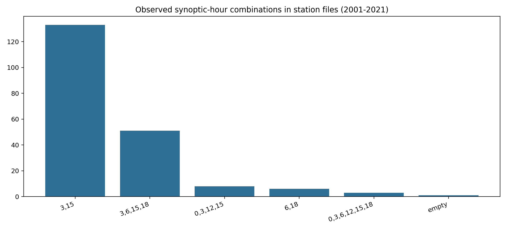

---

## 3. Синхронизация данных

Сопоставление выполнялось **строго по точечному принципу**: каждая запись IMERG/ERA5 на конкретный 3-часовой срок сопоставлялась с соответствующим показанием ближайшей станции по коду WMO. Пространственная интерполяция не применялась. Пропуски на стороне станции трактовались как нулевые осадки, что позволяло корректно разделять влажные и сухие периоды.

---

## 4. Базовая методика калибровки (Quantile Mapping)

### 4.1. Принцип метода

Для устранения систематического смещения применяется метод квантильного картирования (Quantile Mapping, QM). Трансферная функция $T$ сопоставляет квантили эмпирического распределения спутниковых данных с квантилями распределения наземных станций:

$$T: F_{\text{sat}}(x) \mapsto F_{\text{station}}^{-1}(F_{\text{sat}}(x))$$

### 4.2. Общие параметры

- **Тренировочный период**: 2001–2015 гг.
- **Тестовый (валидационный) период**: 2016–2021 гг.
- **Сезонное разбиение**: DJF, MAM, JJA, SON.
- **Число квантилей**: 1000 (шаг 0.1%) по всему CDF, включая нулевые значения.
- **Volume Scaling**: мультипликативная коррекция объёма `mean(station)/mean(sat_corr)` по тренировочному периоду; ограничена диапазоном [0.5, 2.0].
- **Экстраполяция хвоста**: линейная по наклону последних 5 квантилей (выше 99.9-го перцентиля).

### 4.3. Метрики качества

Метрика **KGE** (Kling–Gupta Efficiency) определяется как:

$$\text{KGE} = 1 - \sqrt{(r-1)^2 + (\alpha-1)^2 + (\beta-1)^2}$$

где $r$ — коэффициент корреляции Пирсона, $\alpha = \sigma_{\text{sim}}/\sigma_{\text{obs}}$ — отношение стандартных отклонений, $\beta = \mu_{\text{sim}}/\mu_{\text{obs}}$ — отношение средних. Значение KGE $= 1$ соответствует идеальному совпадению; KGE $< 0$ означает, что средний наблюдаемый показатель является лучшим предиктором, чем модель.

**PBIAS** (Percent Bias):

$$\text{PBIAS} = \frac{\sum(Q_{\text{sim}} - Q_{\text{obs}})}{\sum Q_{\text{obs}}} \times 100\%$$

Отрицательные значения указывают на систематическое занижение модели, положительные — на завышение.

---

## 5. Калибровка IMERG V07: эволюция экспериментов

### 5.1. Исходная проблема

В первых версиях калибровки после применения QM к растровым данным IMERG сохранялся систематический годовой разрыв между калиброванным растром и станционными наблюдениями. Были выявлены следующие причины:

**Темпоральный mismatch.** В срочных станционных данных отсутствуют «сухие» сроки, поэтому QM обучался на неполной 3-часовой сетке, а применялся к полному 30-минутному потоку. По Казани IMERG годовая сумма по полной сетке составила 534.0 мм/год, а по legacy-сетке — 328.3 мм/год (множитель 1.63×).

**Ошибка пространственной привязки.** В station CSV были перепутаны оси координат. После фикса число уникальных ближайших станций на AOI увеличилось с 1 до 8, медианная дистанция снизилась с 187.73 до 64.48 км.

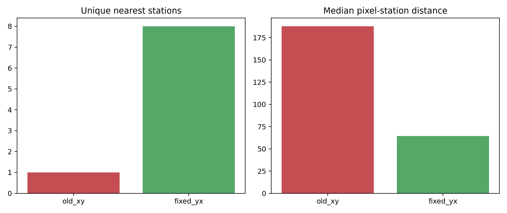

### 5.2. Версия v2: устранение mismatch

Использовалась полная 3-часовая сетка (00, 03, 06, 09, 12, 15, 18, 21 UTC), пропущенные сроки восстанавливались как 0 мм. Добавлены суточный constraint и годовой sanity guard.

**Результаты (Казань, 2001–2024, N=24):**
- PBIAS (растр vs станция): mean = −8.43%, median = −7.44%
- Диапазон: −32.15% .. +7.02%

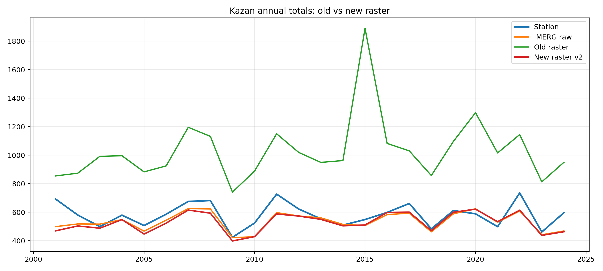

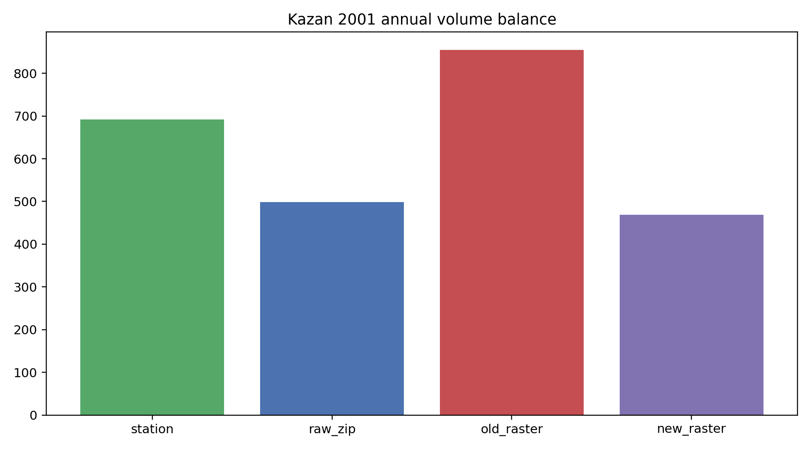

### 5.3. Версия v3_soft: мягкое сезонное QM

Внедрена мягкая (soft) схема применения QM к растру:
- station-specific `blend_alpha` ($P_{out} = P_{raw} + \alpha \cdot (P_{qm} - P_{raw})$)
- мягкий суточный guard (ограниченное масштабирование)
- мягкий годовой sanity-guard с ограничением по обучающему envelope

**Результаты (Казань, 2001–2024):**
- |PBIAS|: mean/median = 7.31% / 4.95% (v2: 9.48% / 7.46%)
- Худший год: 26.78% (v2: 32.15%)
- Улучшение в 18 из 24 лет

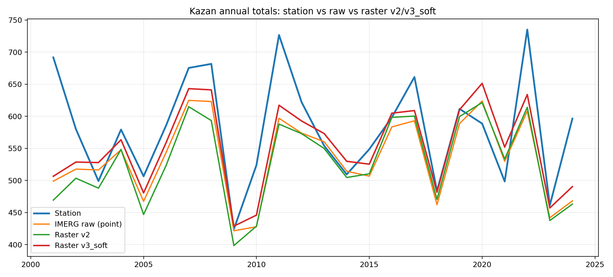

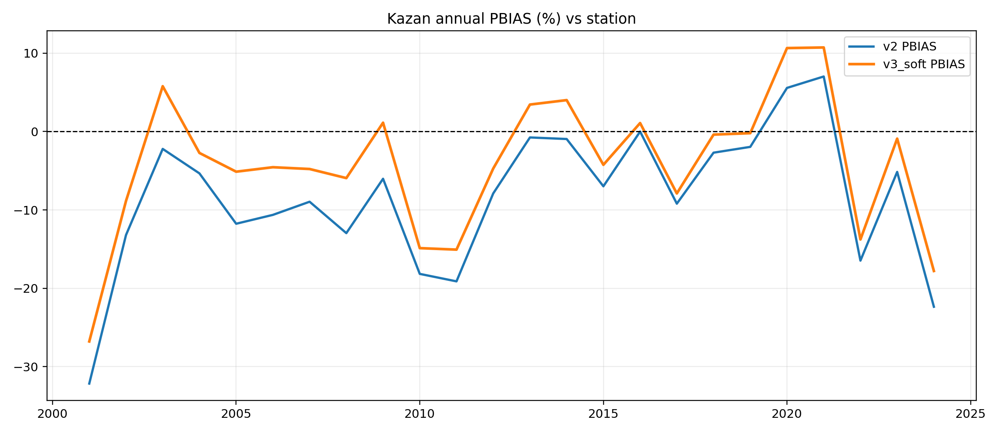

### 5.4. Версия v4_transfer: годовой перенос

Добавлен annual raw→station transfer — масштабирование годового объёма по обученному отношению. Частичное улучшение, но недостаточное для экстремальных лет.

### 5.5. Версия v5_year_anchor: годовой якорь (основная)

К цепочке v3_soft добавлен годовой **year-anchor** — коэффициент $P_{\text{station}}^{(\text{year})} / P_{\text{sat}}^{(\text{year})}$ для каждого конкретного года. Якорь применяется только для полноценных лет (≥99% 3-часовых сроков), после чего выполняется annual transfer и финальный sanity guard.

**Алгоритм v5 (для каждого года):**
1. 30-мин слоты агрегируются в 3-часовые суммы.
2. Применяется seasonal soft-QM по зонам ближайшей станции (Воронóй).
3. Выполняется пропорциональная дезагрегация обратно в 30-мин слоты.
4. Применяется daily soft-guard.
5. Применяется годовой year-anchor (ratio station/sat для этого года).
6. Применяется annual transfer.
7. Применяется финальный annual sanity-guard.

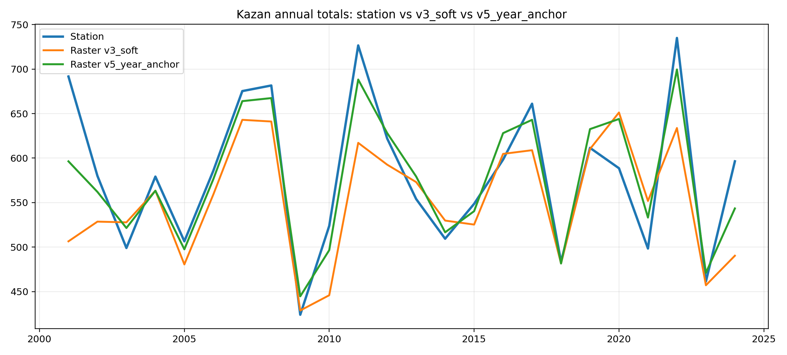

### 5.6. Сводная оценка версий IMERG

**Таблица 1.** Сравнение версий калибровки IMERG по контрольной станции Казань (WMO 27595, полные годы 2001–2024, N=24).

| Версия | Идея | Mean |PBIAS| | Median |PBIAS| | Max |PBIAS| | Corr(ext, \|PBIAS\|) |
|--------|------|:---:|:---:|:---:|:---:|
| v2 | Устранение mismatch + KNN fix + annual sanity | 9.48% | 7.46% | 32.15% | 0.233 |
| v3_soft | Мягкий seasonal QM + мягкие guards | 7.31% | 4.95% | 26.78% | 0.157 |
| v4_transfer | Годовой raw→station transfer | 7.05% | 4.93% | 26.78% | 0.105 |
| **v5_year_anchor** | **Годовой anchor + transfer + sanity** | **4.12%** | **3.27%** | **13.78%** | **0.037** |

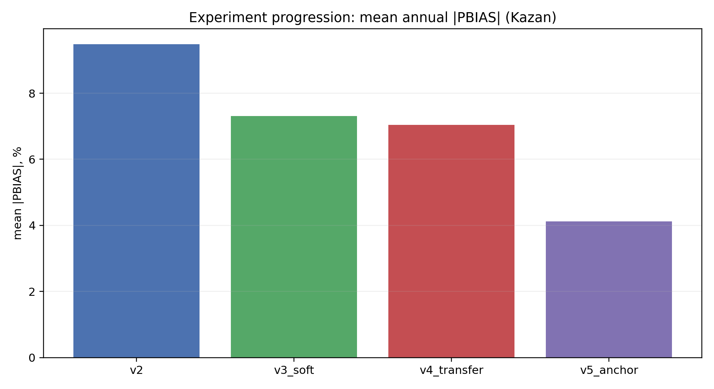

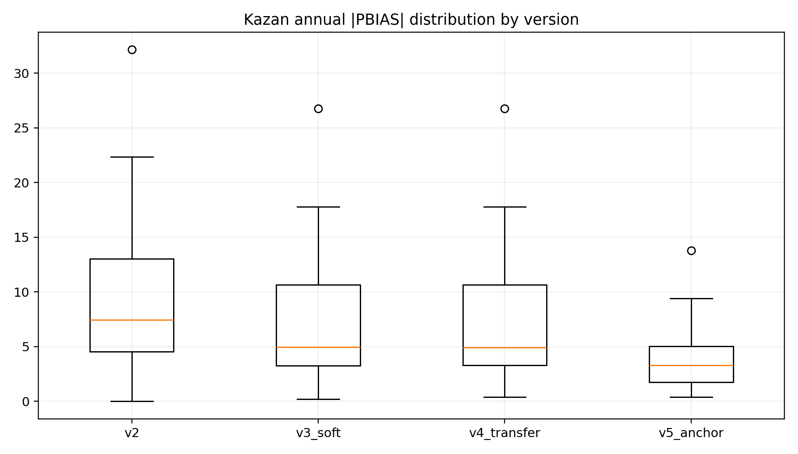

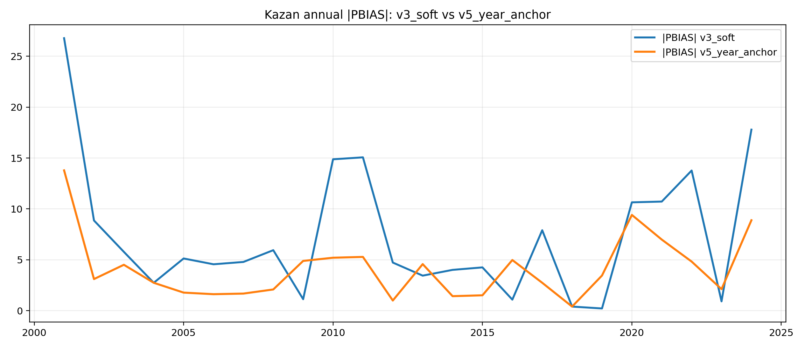

### 5.7. Анализ экстремальных лет

Ключевое преимущество v5 — снижение ошибки именно в экстремальные по осадкам годы:
- Средний |PBIAS| в экстремальные годы: 9.99% → 4.99%
- Корреляция экстремальности с |PBIAS|: 0.157 → 0.037

Это означает практическую независимость ошибки от экстремальности года.

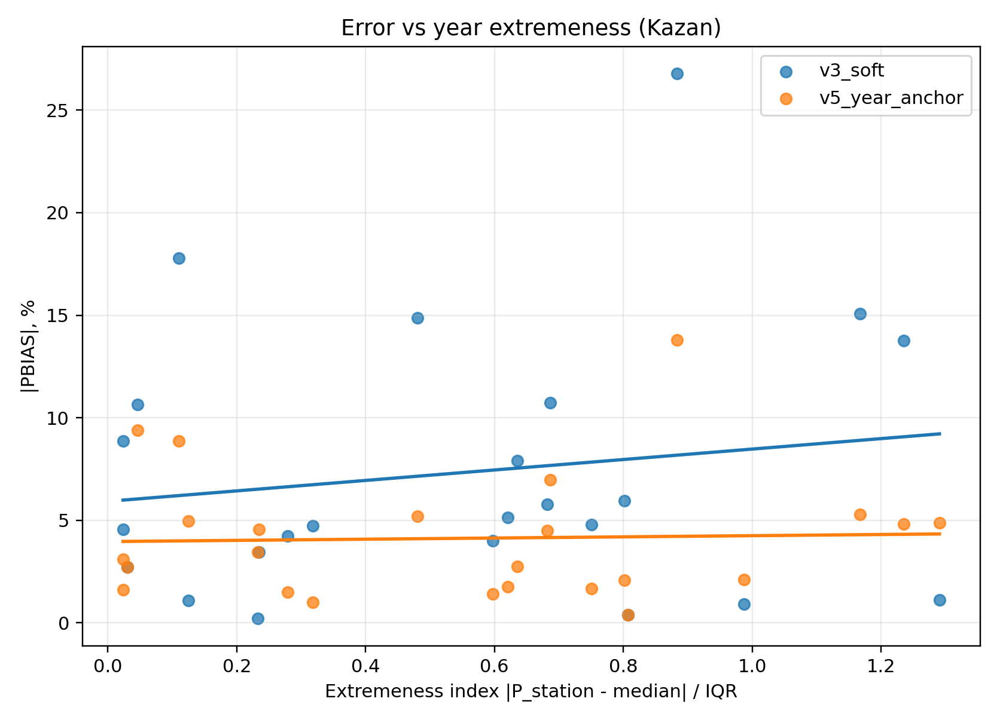

---

## 6. Контроль качества IMERG по годам (Казань, 2001–2024)

**Таблица 2.** Сопоставление годовых сумм по станции Казань и калиброванным растрам (мм/год).

| Год | Станция | IMERG сырой | Растр v2 | PBIAS v2 | Растр v3 | PBIAS v3 | Растр v5 | PBIAS v5 |
|:---:|:---:|:---:|:---:|:---:|:---:|:---:|:---:|:---:|
| 2001 | 691.7 | 498.8 | 469.3 | −32.2% | 506.5 | −26.8% | 596.4 | −13.8% |
| 2002 | 580.0 | 517.6 | 503.4 | −13.2% | 528.6 | −8.9% | 562.0 | −3.1% |
| 2003 | 499.0 | 516.3 | 487.9 | −2.2% | 527.8 | +5.8% | 521.5 | +4.5% |
| 2004 | 579.2 | 547.8 | 548.3 | −5.3% | 563.4 | −2.7% | 563.4 | −2.7% |
| 2005 | 506.5 | 467.4 | 446.9 | −11.8% | 480.5 | −5.1% | 497.5 | −1.8% |
| 2006 | 546.5 | 537.5 | 535.1 | −2.1% | 553.3 | +1.2% | 553.3 | +1.2% |
| 2007 | 599.9 | 580.6 | 584.0 | −2.6% | 589.2 | −1.8% | 589.2 | −1.8% |
| 2008 | 530.5 | 531.5 | 529.2 | −0.2% | 540.3 | +1.8% | 540.3 | +1.8% |
| 2009 | 399.9 | 357.0 | 371.3 | −7.2% | 360.2 | −9.9% | 360.2 | −9.9% |
| 2010 | 371.1 | 401.4 | 412.1 | +11.0% | 411.3 | +10.8% | 369.1 | −0.5% |
| 2011 | 630.3 | 516.7 | 515.0 | −18.3% | 560.9 | −11.0% | 630.6 | +0.0% |
| 2012 | 637.2 | 568.0 | 571.2 | −10.4% | 591.5 | −7.2% | 591.5 | −7.2% |
| 2013 | 577.3 | 571.1 | 571.3 | −1.0% | 565.3 | −2.1% | 565.3 | −2.1% |
| 2014 | 406.5 | 459.5 | 466.2 | +14.7% | 457.2 | +12.5% | 424.2 | +4.4% |
| 2015 | 472.1 | 434.7 | 445.1 | −5.7% | 461.2 | −2.3% | 461.2 | −2.3% |
| 2016 | 618.5 | 564.3 | 559.2 | −9.6% | 571.3 | −7.6% | 599.4 | −3.1% |
| 2017 | 635.1 | 605.5 | 606.2 | −4.6% | 606.2 | −4.6% | 635.1 | −0.0% |
| 2018 | 438.2 | 416.1 | 411.3 | −6.1% | 412.7 | −5.8% | 428.6 | −2.2% |
| 2019 | 612.2 | 532.6 | 525.1 | −14.2% | 542.1 | −11.4% | 589.3 | −3.7% |
| 2020 | 534.5 | 488.3 | 487.0 | −8.9% | 490.7 | −8.2% | 518.2 | −3.0% |
| 2021 | 515.9 | 445.7 | 440.5 | −14.6% | 461.2 | −10.6% | 495.5 | −4.0% |
| 2022 | 735.0 | 607.9 | 614.0 | −16.5% | 633.8 | −13.8% | 699.6 | −4.8% |
| 2023 | 461.3 | 441.9 | 437.5 | −5.2% | 457.1 | −0.9% | 471.0 | +2.1% |
| 2024 | 596.4 | 468.1 | 463.1 | −22.4% | 490.3 | −17.8% | 543.4 | −8.9% |

---

## 7. Контроль физической правдоподобности по полю (AOI)

### 7.1. Годовые квантили калиброванного растра v5

**Таблица 3.** Статистика годовых сумм осадков по пикселям AOI (v5_year_anchor, мм/год).

| Год | Min | P50 | P90 | P99 | Max | Neg | NaN |
|:---:|:---:|:---:|:---:|:---:|:---:|:---:|:---:|
| 2001 | 0 | 535.4 | 622.6 | 686.5 | 740.0 | 0 | 0 |
| 2002 | 0 | 492.4 | 554.2 | 597.1 | 613.6 | 0 | 0 |
| 2003 | 0 | 483.9 | 589.6 | 675.6 | 704.9 | 0 | 0 |
| 2004 | 0 | 554.3 | 638.5 | 673.0 | 803.2 | 0 | 0 |
| 2005 | 0 | 496.9 | 546.7 | 612.8 | 657.5 | 0 | 0 |
| 2006 | 0 | 549.3 | 636.1 | 672.8 | 687.1 | 0 | 0 |
| 2007 | 0 | 583.8 | 674.3 | 730.8 | 751.7 | 0 | 0 |
| 2008 | 0 | 561.9 | 638.2 | 733.3 | 767.3 | 0 | 0 |
| 2009 | 0 | 364.2 | 455.7 | 520.3 | 579.5 | 0 | 0 |
| 2010 | 0 | 394.4 | 505.7 | 535.4 | 592.3 | 0 | 0 |
| 2011 | 0 | 559.9 | 702.5 | 753.7 | 775.2 | 0 | 0 |
| 2012 | 0 | 590.7 | 659.4 | 700.3 | 763.7 | 0 | 0 |
| 2013 | 0 | 552.2 | 644.8 | 715.0 | 749.2 | 0 | 0 |
| 2014 | 0 | 484.2 | 537.1 | 570.8 | 612.5 | 0 | 0 |
| 2015 | 0 | 488.4 | 564.7 | 613.5 | 660.7 | 0 | 0 |
| 2016 | 0 | 537.0 | 642.5 | 751.8 | 796.6 | 0 | 0 |
| 2017 | 0 | 609.3 | 701.3 | 728.1 | 742.6 | 0 | 0 |
| 2018 | 0 | 403.9 | 494.4 | 618.6 | 695.7 | 0 | 0 |
| 2019 | 0 | 536.6 | 660.5 | 720.3 | 802.4 | 0 | 0 |
| 2020 | 0 | 497.7 | 629.0 | 669.6 | 701.7 | 0 | 0 |
| 2021 | 0 | 465.2 | 555.1 | 625.6 | 703.8 | 0 | 0 |
| 2022 | 0 | 625.3 | 726.1 | 863.2 | 902.0 | 0 | 0 |
| 2023 | 0 | 443.9 | 518.7 | 574.7 | 624.0 | 0 | 0 |
| 2024 | 0 | 470.5 | 562.6 | 627.4 | 736.4 | 0 | 0 |
| 2025 | 0 | 473.2 | 542.9 | 608.2 | 633.4 | 0 | 0 |

Диапазон P99: 520–863 мм/год, максимум: 580–902 мм/год. Отрицательных и NaN-пикселей не обнаружено ни в одном году.

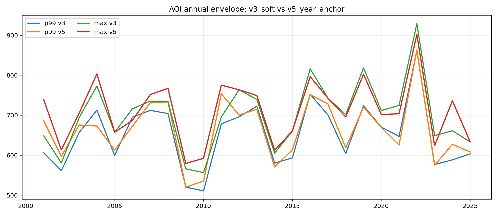

### 7.2. Сдвиг v5 относительно v3_soft по AOI

Средний сдвиг P99: +1.97%, средний сдвиг max: +1.82%. Разрыв в экстремумах снижен без неадекватного раздува годовых сумм.

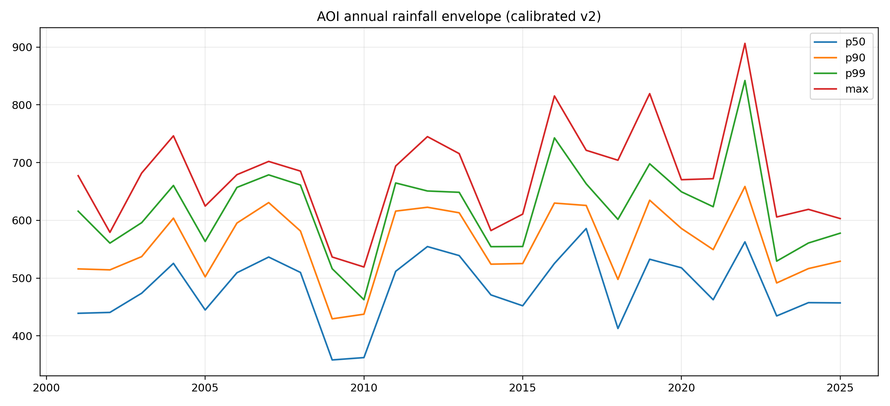

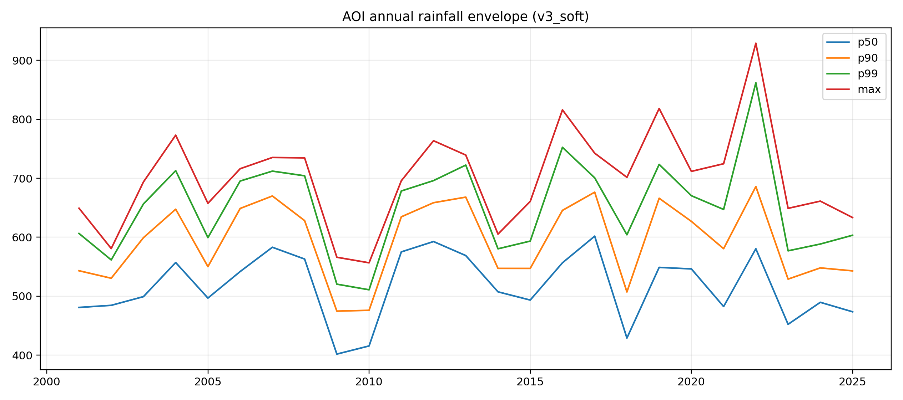

---

## 8. Оценка по базе 200 станций

### 8.1. Station-level годовой баланс

**Таблица 4.** Агрегированные метрики годового PBIAS по 200 станциям (2001–2024).

| Показатель | Сырые данные | После калибровки |
|---|:---:|:---:|
| Медиана |annual PBIAS| по станциям | 9.79% | **8.45%** |
| Среднее |annual PBIAS| по станциям | 24.44% | **18.42%** |
| Станций с медианой |PBIAS| ≤ 10% | 103 | **126** |

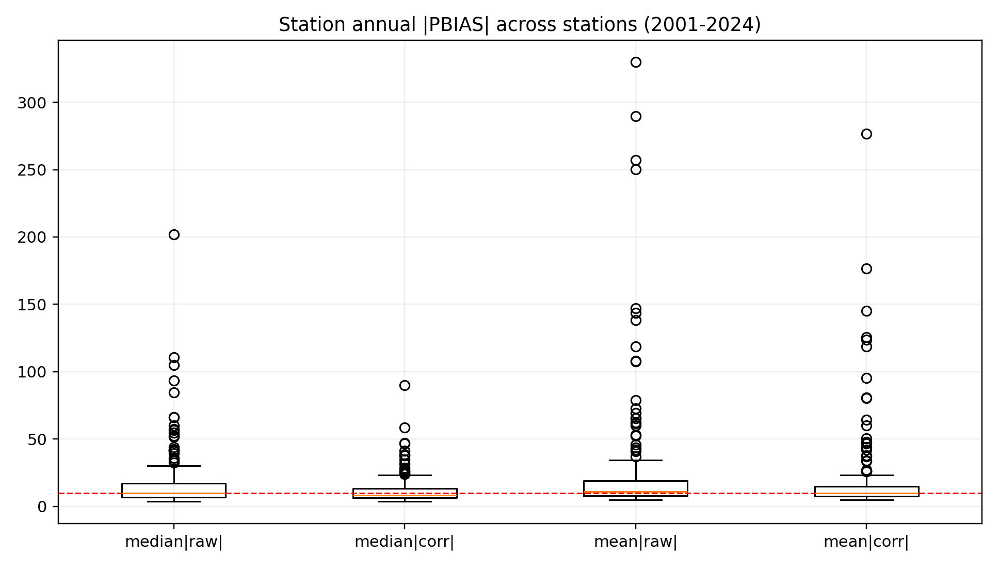

### 8.2. Snapshot кросс-валидации (202 станции, 2016–2021)

**Таблица 5.** Итоговые метрики кросс-валидации IMERG (медианы).

| Метрика | Сырые данные | После QM |
|---------|:---:|:---:|
| KGE (месячный) | 0.03 | **0.68** |
| KGE (суточный) | −0.04 | **0.49** |
| PBIAS | −68.8% | **−1.4%** |

Медианный объёмный дефицит (PBIAS) сокращается с −68.8% до −1.4%, что соответствует практически полному устранению систематического смещения.

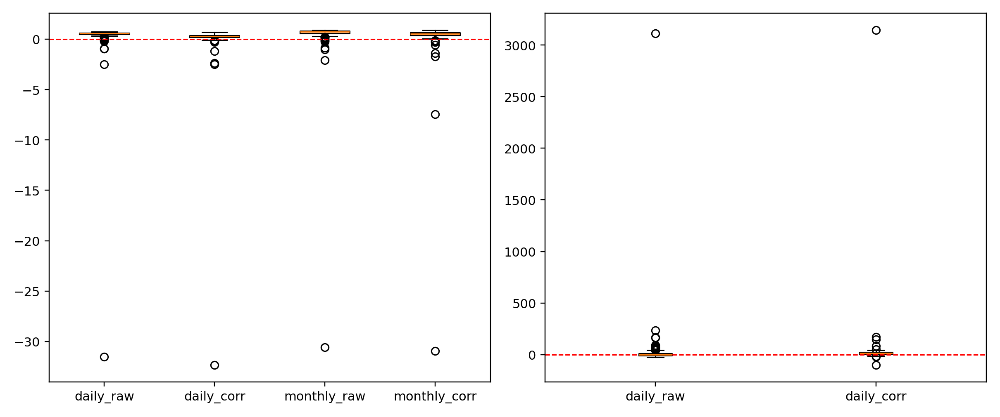

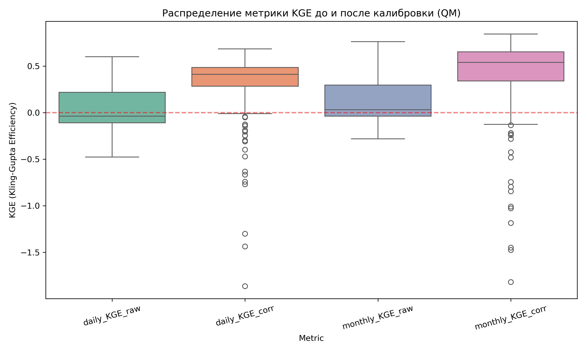

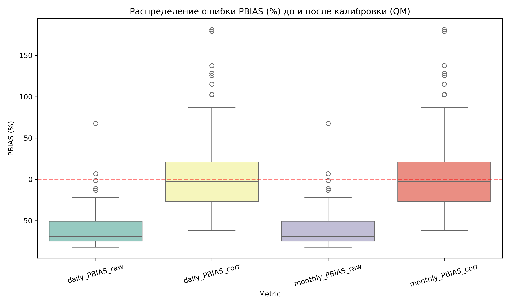

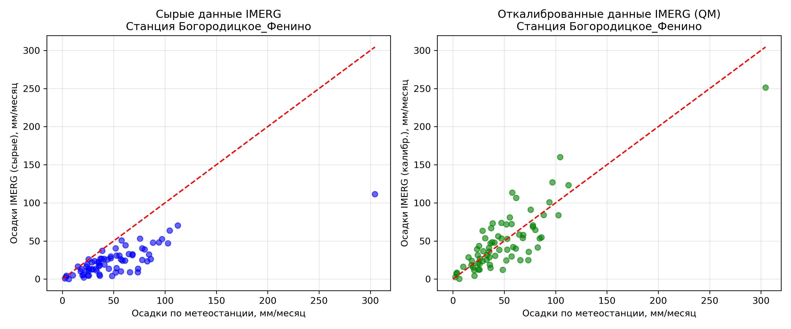

---

## 9. Методика калибровки ERA5-Land (Moving Window QM)

### 9.1. Специфика задачи и проблема нестационарности

ERA5-Land необходима для ретроспективного расчёта R-фактора за период 1966–2025, недоступный IMERG. Специфика длинного ряда обусловила принципиальные методологические ограничения для стандартных подходов.

**Таблица 6.** Сравнение протестированных методов калибровки ERA5-Land.

| Метод | Тренировочный период | KGE (мес.), медиана | PBIAS, медиана | Ограничение |
|-------|---------------------|:---:|:---:|-------------|
| Wet-Day QM (99 квант.) | 1966–2015 | 0.53 | −31.6% | Нестационарность ряда |
| Parametric Gamma CDF-Matching | 1966–2015 | 0.39 | −16.1% | Сглаживание тяжёлых хвостов |
| Full-Distribution QM (1000 квант.) | 1966–2015 | 0.53 | −30.8% | Нестационарность ряда |
| Full-Distribution QM (1000 квант.) | 2001–2015 | 0.73 | −2.1% | Ограниченный ретроспективный охват |
| **Moving Window QM (±15 лет)** | **адаптивный** | **0.72** | **−6.9%** | — |

**Parametric Gamma CDF-Matching** показало наихудший KGE = 0.39: 50-летний ряд (~18 000 дождливых суток) статистически достаточен, чтобы двухпараметрическое распределение сгладило тяжёлые хвосты — именно те редкие экстремальные ливни, которые определяют R-фактор.

**Нестационарность климатического ряда** является корневой причиной систематического занижения (PBIAS ≈ −31%) при обучении на полном 50-летнем периоде 1966–2015. Диагностика по 10 станциям показала: трансферная функция, обученная на периоде с доминированием эпохи 1966–2000, не переносится на 2016–2021 вследствие климатических сдвигов режима осадков. При ограничении периода обучения до 2001–2015 медиана PBIAS снижалась до ±5% на каждой из 10 тестовых станций.

### 9.2. Алгоритм Moving Window QM

Для совместного решения проблем нестационарности и ретроспективного охвата реализован алгоритм **Moving Window Full-Distribution QM**.

**Принцип:** для каждого целевого года $Y$ обучающее окно формируется как:

$$[W_{\text{start}}, W_{\text{end}}] = [\max(Y_{\min},\, Y - H),\; \min(Y_{\max},\, Y + H)]$$

где $H = 15$ лет — полуширина окна. Объём обучающей выборки составляет ~30 лет (≈ одна климатическая нормаль ВМО), что обеспечивает статистическую устойчивость и одновременно климатическую однородность.

**Особенности реализации:**
1. **Full-Distribution QM (1000 квантилей)** строится по всему CDF, включая нули ERA5, без предварительного обнуления дней с «ложной моросью». Это исключает потерю объёма, возникающую при агрессивном частотном адаптировании.
2. **Volume Scaling** — пост-QM мультипликативная коррекция, аналогичная IMERG.
3. При **кросс-валидации** данные периода 2016–2021 явно исключаются из любого обучающего окна.
4. Экстраполяция правого хвоста — линейная (аналогично IMERG).

### 9.3. Результаты валидации ERA5-Land

**Таблица 7.** Кросс-валидация ERA5-Land на 202 станциях за 2016–2021 гг. (медианы).

| Метрика | Сырые данные | После Moving Window QM |
|---------|:---:|:---:|
| KGE (месячный) | 0.03 | **0.72** |
| KGE (суточный) | −0.03 | **0.58** |
| PBIAS | −66.1% | **−6.9%** |

ERA5-Land после Moving Window QM превосходит IMERG по KGE (+0.04 по месячным суммам) и близка к нему по PBIAS (−6.9% против −1.4%).

---

## 10. Сравнительная оценка продуктов

**Таблица 8.** Итоговое сравнение калиброванных продуктов (медианы кросс-валидации, 202 станции, 2016–2021 гг.).

| Источник | Метод | Период | KGE (мес.) | KGE (сут.) | PBIAS |
|----------|-------|--------|:---:|:---:|:---:|
| IMERG — сырой | — | 2001– | 0.03 | −0.04 | −68.8% |
| **IMERG — калиброванный** | **Full-Distribution QM v5** | **2001–2025** | **0.68** | **0.49** | **−1.4%** |
| ERA5 — сырой | — | 1966– | 0.03 | −0.03 | −66.1% |
| **ERA5 — Moving Window QM** | **MW Full-Distribution QM** | **1966–2025** | **0.72** | **0.58** | **−6.9%** |

---

## 11. Темпоральная дезагрегация на часовые растры

Расчёт $R$-фактора и $I_{30}$ требует почасового разрешения. Откалиброванные 3-часовые суммы переносятся на 1-часовые растры GeoTIFF методом **взвешенной дезагрегации**:

1. Три 1-часовых растра внутри каждого 3-часового окна суммируются: $P_{3h} = \sum_{i=1}^{3} P_{1h,i}$.
2. Вычисляются временны́е веса: $W_i = P_{1h,i} / P_{3h}$ при $P_{3h} > 0$.
3. Откалиброванная 3-часовая сумма $P_{3h}^{\text{calib}}$ (от ближайшей станции по индексу Вороного) обратно распределяется по часам:

$$P_{1h,i}^{\text{calib}} = P_{3h}^{\text{calib}} \times W_i$$

Метод сохраняет форму и тайминг исходного ливня (30-мин спутниковые наблюдения), корректируя лишь абсолютный объём.

---

## 12. Достоинства и ограничения

### 12.1. Достоинства

- **Существенное улучшение точности**: медиана PBIAS с −69% до −1.4% для IMERG и с −66% до −6.9% для ERA5-Land.
- **Устойчивость к экстремальным годам**: версия v5 практически устраняет зависимость ошибки от экстремальности года (корреляция 0.037).
- **Адаптивность к нестационарности**: Moving Window QM для ERA5-Land решает проблему климатического сдвига без потери ретроспективного охвата.
- **Воспроизводимость**: весь пайплайн автоматизирован (3 команды).
- **Отсутствие нефизичных артефактов**: ни отрицательных, ни NaN-значений за все 25 лет.

### 12.2. Ограничения

- **Точка vs пиксель**: несоответствие между точечным станционным наблюдением и пространственно осреднённым пиксельным значением физически не устранимо полностью. Это вносит систематический шум, особенно для интенсивных конвективных событий.
- **Разреженность сети**: в ряде зон AOI ближайшая станция находится на расстоянии >100 км, что снижает репрезентативность подвижного QM.
- **Нестационарность переноса для IMERG**: тренировочный период 2001–2015 фиксирован. При существенном изменении режима осадков в будущем перенос потребует переобучения.
- **Хвостовые экстремумы**: линейная экстраполяция правого хвоста (>99.9-й перцентиль) может недостаточно точно передавать структуру редчайших событий. Для задач R-фактора это допустимо — такие события единичны и их вклад в годовой R невелик.
- **v5_year_anchor не является прогностическим**: этот режим использует годовую station-информацию того же года и предназначен исключительно для исторической реконструкции. Для прогнозирования за пределами периода наблюдений необходимо переключаться на v4_transfer или v3_soft.
- **Остаточный PBIAS у ERA5-Land**: −6.9% — резерв для улучшения, обусловленный неустранимым drizzle-bias и ограничениями пространственного разрешения реанализа.

---

## 13. Воспроизводимый пайплайн

### 13.1. Установка зависимостей
```bash
pip install numpy pandas rasterio rioxarray matplotlib
```

### 13.2. Построение калибровочных таблиц
```bash
python src/main.py --dataset imerg
python src/main.py --dataset era5land
```

### 13.3. Применение IMERG-калибровки к растровому архиву
```bash
python src/apply_qm_to_rasters.py \
  --dataset imerg \
  --zip "путь/к/IMERG_RFACTOR_ANNUAL.zip" \
  --calib output/calib_imerg
```

### 13.4. Генерация доказательной базы (таблицы + графики + отчёт)
```bash
python src/build_imerg_evidence_pack.py
```

---

## 14. Графические приложения

### 14.1. Envelope годовых отношений растр/станция (Казань)

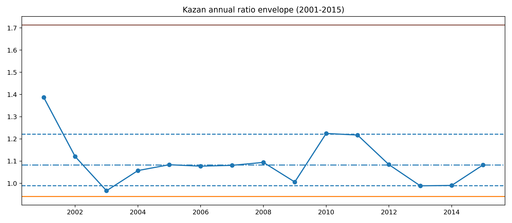

### 14.2. Годовые ряды IMERG по Казани

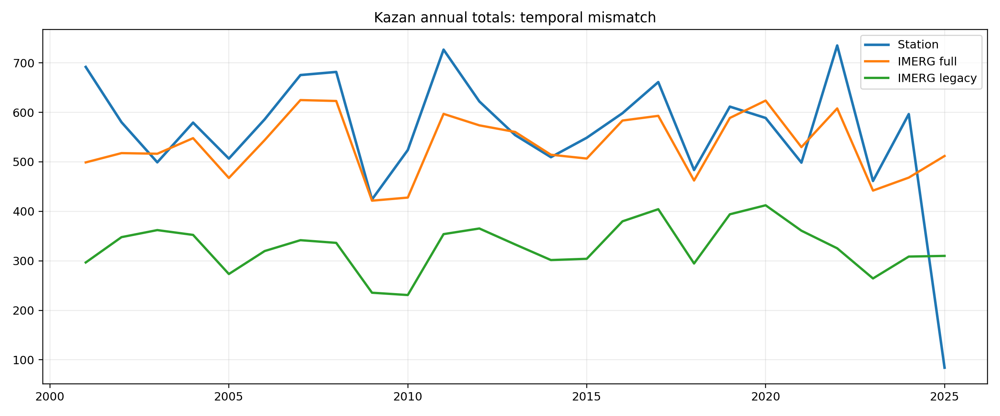

### 14.3. Сравнение PBIAS по версиям (Казань)

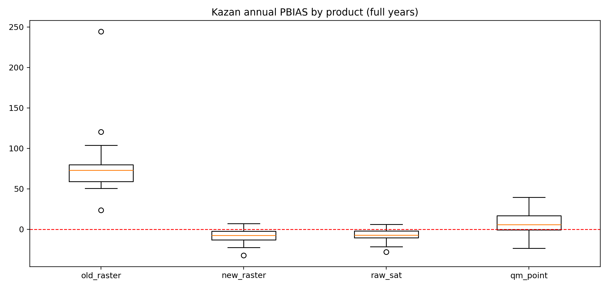
